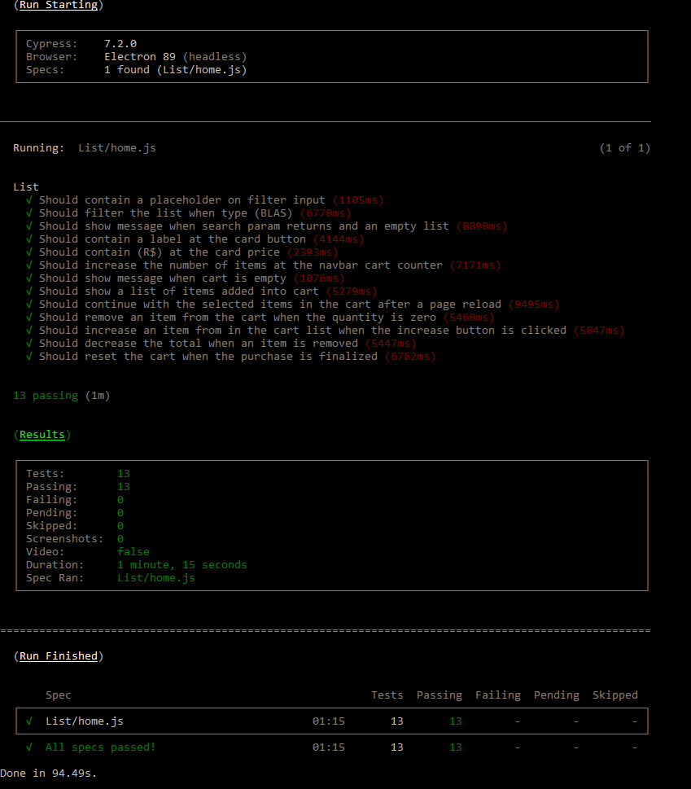
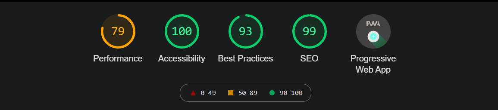
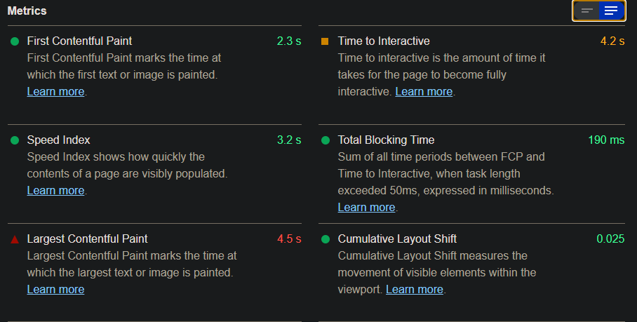

# O que foi desenvolvido?
- [x] Catálogo de produtos.
- [x] Carrinho lateral.
- [x] Resumo do carrinho.
- [x] 3 lojas com estilos e tipos diferentes de Pokémon.
- [x] Barra de busca para filtrar os Pokémon.
- [x] Botão de finalizar compra, reiniciando o processo de compra.
- [x] Modal de obrigado ao finalizar compra.

#### Tarefas adicionais
- [x] Salvar os dados da compra do usuário [localmente](#localstorage) para não perdê-las ao atualizar a página.
- [x] [Testes E2E/UI automatizados](#cypress) para garantir que suas funcionalidades estão funcionando corretamente.
- [x] [Colocá-lo online em alguma url pública](#vercel) para que as pessoas consigam utilizar a loja.
- [x] [Alguns pontos de performance](#perfomance) (Lighthouse).
- [x] Alguns pontos de acessibilidade (Screen reader).

##  Links disponíveis para acesso à aplicação
A aplicação foi disponibilizadas em três rotas diferentes, uma para cada um dos tipos de pokémon (Água, Fogo e Dragão).

- [Água](https://pokemon-store-water.vercel.app/)
- [Fogo](https://pokemon-store-two.vercel.app/)
- [Dragão](https://pokemon-store-dragon.vercel.app/)

## Controle de estilos
Para que os vários estilos da aplicação pudessem ser aplicados, foi adicionado uma variável de ambiente.

De acordo com o resultado que ela recebe, um grupo específico de estilos são carregados.

Quando a aplicação é publicado no [Vercel](https://vercel.com/), podemos trocar a valor da variável de ambiente.

##  Dados salvos localmente
Foi utilizado o [localStorage](https://developer.mozilla.org/pt-BR/docs/Web/API/Window/localStorage) para que os itens adicionados no carrinho continuassem salvos mesmo após um evento recarregamento/fechamento da página.

##  Testes E2E
Foi utilzado o [Cypress](https://www.cypress.io/) para a relização dos testes.

Testes realizados

##  Testes E2E
Dos pontos, apenas o de performance não alcançou uma pontuação alta em relação aos demais.

Resultado dos testes

